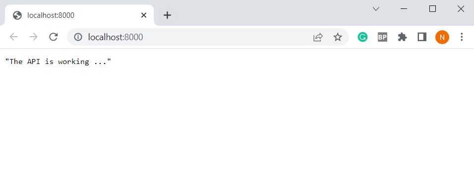
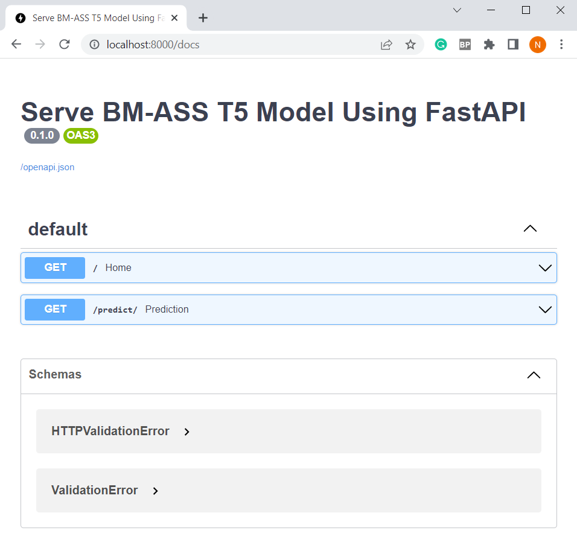

[](https://colab.research.google.com/drive/1KKt6A-SEgbIZ3olUNFts5W93YU0ZyZf_?usp=sharing)


# BM ASS
Fine-tune and deploy a model to highlight the most important paragraph of a given multi-paragraph document. However, to accomplish our task, we will fine-tune the T5 model using PyTorch and the Hugging-Face transformers library to extract the important paragraph in a multi-paragraph document or article. By training the T5 model on a dataset of labeled documents, where the task is to predict which paragraph is important. Thus, we can then use the fine-tuned model to make predictions on unseen documents. This task is similar to summarization, where the important paragraph serves as the summary of the document or article in question.


## Table of contents
- [Tech Stack](#tech-stack)
- [Repo Structure](#repo-structure)
- [Installation](#installation)
- [Docker Hub](#docker-hub)
- [Author Infos](#author-infos)


## Tech Stack
- [x] Hugging Face
- [x] PyTorch
- [x] FastAPI
- [x] Docker


## Repo Structure
Note that some *unnecessary* and *large* files are ***ignored***
```
BM-ASS
    ├── assets
    ├── data
    ├── models
    |   └── output
    |        └── t5ass.bin
    ├── notebooks
    ├── src
    │   ├── utils
    │   │    ├── __init__.py
    │   │    ├── config.py
    │   │    ├── dataset.py
    │   │    ├── engine.py
    │   │    ├── model.py
    │   │    ├── predict.py
    │   │    ├── process.py
    │   │    └── utils.py
    │   ├── __init__.py
    │   └── main.py
    ├── .gitattributes
    ├── .gitignore
    ├── Dockerfile
    ├── README.md
    └── requirements.txt
```

## Installation
* ***Clone it***

Clone the repository, move to the project directory, then:
  1. Creat a virtual env
  2. Install the needed packages and dependencies
  3. Run the server

```
$ git clone https://github.com/zekaouinoureddine/BM-ASS.git
$ cd BM-ASS
$ conda create --name bmenv python==3.10.9
$ pip install -r requirements.txt
$ uvicorn src.main:app --reload
```

* ***Dockerize it***

Build the image and fire up the container:
```
$ docker build --tag bmass .
$ docker run -d --name bmass -p 8000:8000 bmass
```

* ***Run it***

To ensure if the app is running, open you favorite browser then go to [127.0.0.1:8000](http://127.0.0.1:8000/). You should see the following message in the browser ***`The API is working ...`*** .

<p align="center">
  
</p>

* ***Test it***

Once you make sure your API is running on the local server or in the Docker container go to [127.0.0.1:8000/docs](http://127.0.0.1:8000/docs).

<p align="center">
  
</p>

**Two options**
1. Use the **`plain text`** of the multi-paragraph document.
2. Use the **`URL`** of the multi-paragraph news article.

For example here is the result is got after using [URL provided](https://www.theguardian.com/world/2023/jan/19/three-children-among-six-killed-during-indian-kite-flying-festival):

<p align="center">
  
</p>

* ***Stop it***

Before moving on, dont forget to bring down the container:
```
$ docker stop bmass
```

## Docker Hub

Instead of wasting time building the image yourself, you can use the [**image**](https://hub.docker.com/r/zekaouinoureddine/bmass) we pushed to our Docker Hub repository and pull it to your local machine. To do this, use the following command.

```
$ docker pull zekaouinoureddine/bmass
```


> **Please it should be noted that:**
>* There are still many rooms for improvement. For example, to reduce training time and improve model latency, we can use techniques such as knowledge distillation (a distilled version of T5). To improve model performance, we can use more training examples.
>* In my implementation, I did not give a lot of importance to model performance as I focused on the process of building the model and managing it from data to deployment and containerization.
>* I used a very small number of examples to fine-tune the model in order to avoid the out of memory issue that I struggled with a bit, as I do not have access to powerful computing resources.
>* I plan to continue working on improving the project's quality in the future.

## Author Infos

If you like it, give it a ⭐, then follow me on:
- LinkedIn: [Nour Eddine ZEKAOUI](https://www.linkedin.com/in/nour-eddine-zekaoui-ba43b1177/)
- Twitter: [@NZekaoui](https://twitter.com/NZekaoui)

---
[BACK TO THE TOP](#bm-ass)