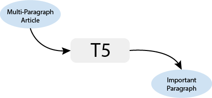
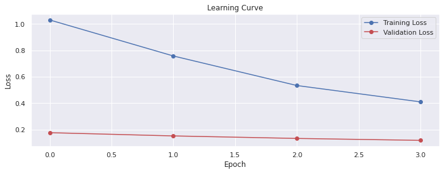

# BM-ASS
The process of fine-tuning a pre-trained T5 model in PyTorch typically involves several steps, such as loading the pre-trained model, adding a custom layer for the task at hand, and training the model on a task-specific dataset. In our case we will use use CNN Dailly Mail dataset to fine-tune our model.

## Scoping
The model takes a multi-paragraph article and outputs the important paragraphs within the article, as illustrated in the figure below:

  

## Data
To fine-tune the pre-trained T5 model, we used the [CNN Daily Mail]() dataset. The dataset is publicaly available on the hugging face [datasets hub](https://huggingface.co/datasets/cnn_dailymail).

## Modeling

We worked with [T5](https://arxiv.org/abs/1910.10683), it a transformer-based model that reframes all natural language processing tasks into a unified text-to-text format where the input and output are always text strings. We used it [base](https://huggingface.co/t5-base) version from hugging face.

  

## Evaluation
The performance of the model is mesured by the similarity between the summary extracted by the model and the original author's highlights, as measured by the [ROUGE](https://huggingface.co/metrics/rouge) score. 

* The main results:

|         | Rouge1  | Rouge2 | Rougel  | Rougelsum | GenLen | Colab | GitHub |
|:-------:|:-------:|:------:|:-------:|:---------:|:------:|:-----:|:------:|
| Results | 58.1348 | 53.202 | 55.9128 | 55.8825   | 1.0    |       |         |

* Loss learning curve:

  

## Deployment
Check the model [deployment](/README.md) with FastAPI and Docker stuff.

> **Please it should be noted that:**
>* There are still many rooms for improvement. For example, to reduce training time and improve model latency, we can use techniques such as knowledge distillation (a distilled version of T5). To improve model performance, we can use more training examples.
>* In my implementation, I did not give a lot of importance to model performance as I focused on the process of building the model and managing it from data to deployment and containerization.
>* I used a very small number of examples to fine-tune the model in order to avoid the out of memory issue that I struggled with a bit, as I do not have access to powerful computing resources.
>* I plan to continue working on improving the project's quality in the future.

---
[BACK TO THE TOP](#bm-ass)